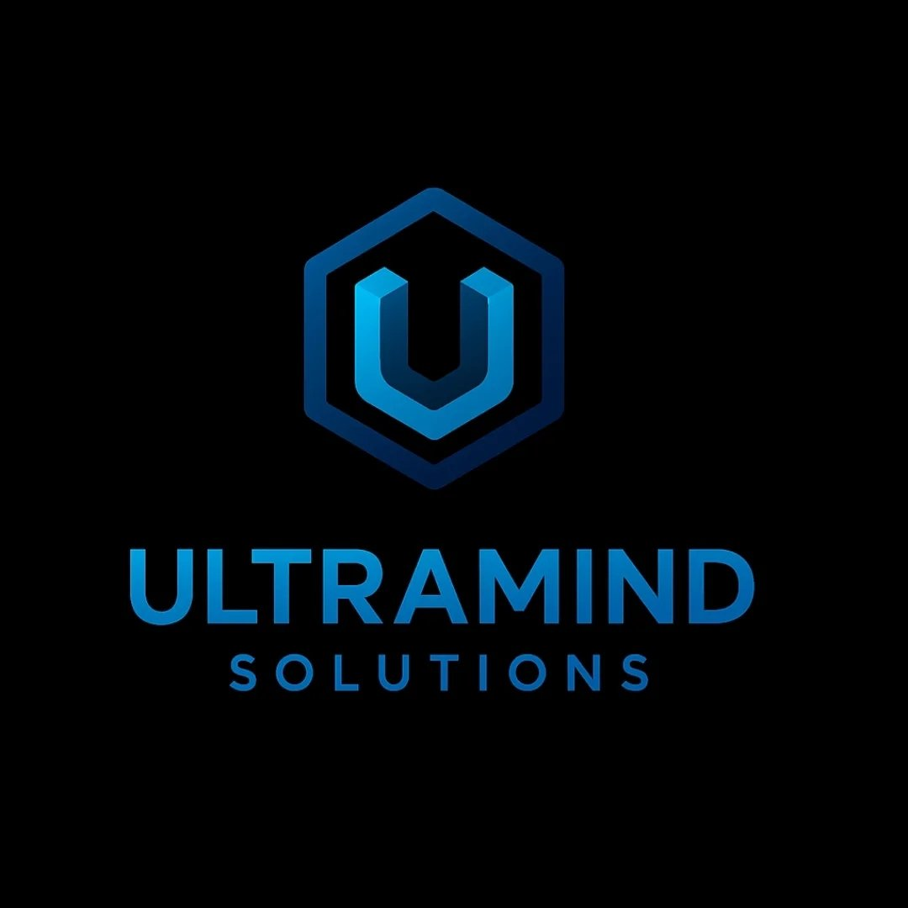

<p align="center">
  
</p>

<h1 align="center">UltraMind Solutions</h1>

<p align="center">
  Automações inteligentes e plataformas SaaS com IA para empresas, empreendedores e criadores que querem crescer mais rápido e com menos esforço.
</p>

<p align="center">
  <a href="https://ultramind-liard.vercel.app/">🌐 Website</a>
</p>

---

## 🧠 Sobre a UltraMind

A **UltraMind Solutions** cria **automações inteligentes** e **plataformas SaaS sob medida**, focadas em otimizar atendimento, processos e escala de negócios utilizando tecnologia moderna e inteligência artificial.

---

## 🎯 O que fazemos

* Automações de atendimento e processos
* Plataformas SaaS e MicroSaaS
* Integrações com Inteligência Artificial
* Soluções digitais focadas em crescimento

---

## ⚙️ Como executar o projeto

```bash
# Clone o repositório
git clone https://github.com/jamesdebugsp/ultramind.git

# Entre na pasta
cd ultramind

# Instale as dependências
npm install

# Rode o projeto
npm run dev
```

📍 Aplicação disponível em:
`http://localhost:5173`

---

## 🛠️ Tecnologias

* React
* Vite
* Tailwind CSS
* Supabase
* Integrações com IA
* Deploy via Vercel

---

## 🚀 Status

🟢 MVP em desenvolvimento ativo.

---

## 👤 Autor

**James Rodrigo**
Founder & Developer — UltraMind Solutions

🔗 GitHub: [https://github.com/jamesdebugsp](https://github.com/jamesdebugsp)
🌐 Website: [https://ultramind-livid.vercel.app/](https://ultramind-livid.vercel.app/)

---

## 📜 Licença

Licença MIT.


<!-- redeploy -->
